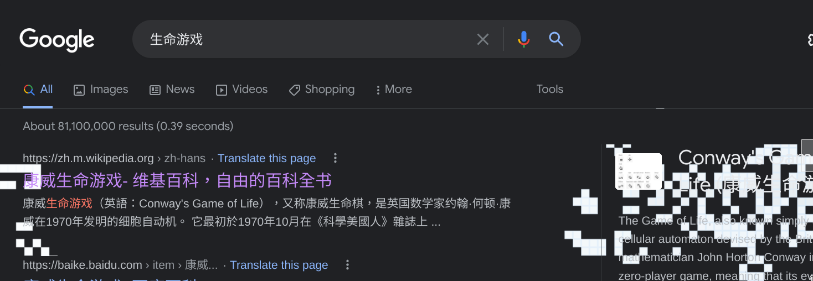
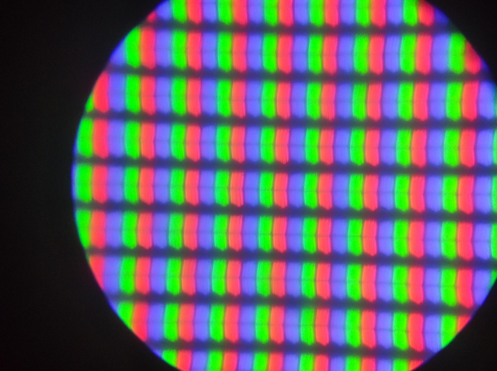
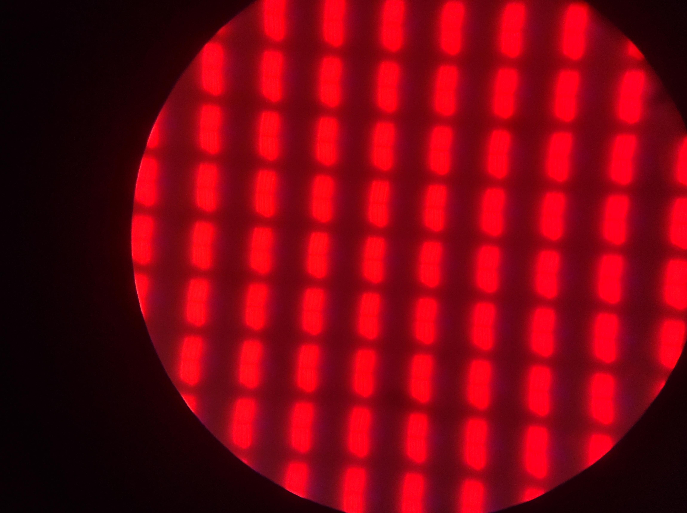
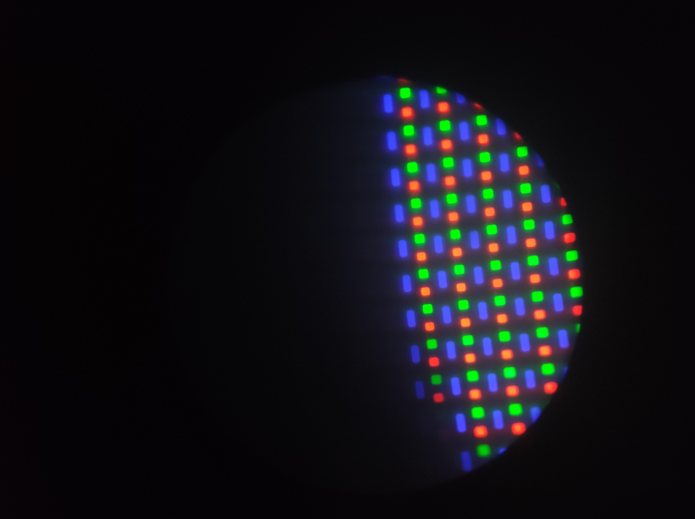
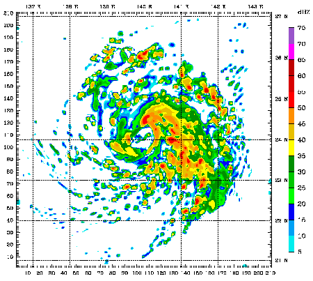
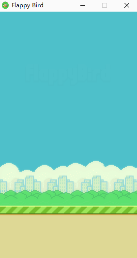
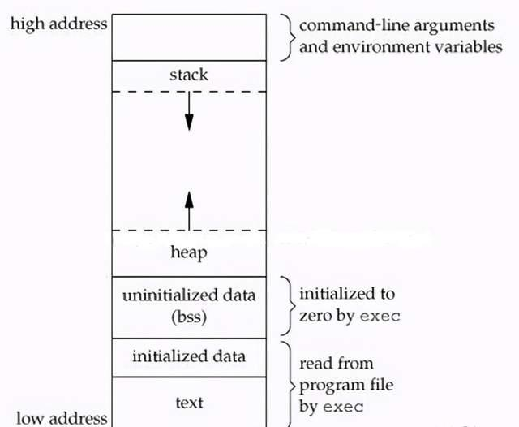

<script src="https://cdn.tailwindcss.com"></script>

# 暴力美学
The beauty of brute force


---

# 枚举暴力，就坏么？
《狂人日记》——鲁迅（并没说过）

--

## 宇宙的本质就是暴力


每次刷新图片都不一样，

令人着迷又向往。

这么美丽的图片很难让人把它和“暴力”联系到一起，

“暴力”真的有这么美吗？

课程结尾将会教大家如何用程序渲染出这样的图片。

<script>
    // 使用 api 渲染图片，兼容不支持 WASM 的浏览器
    function randomInRange(min, max) {
      return Math.random()<0.5? ((1-Math.random()) * (max-min) + min) : (Math.random() * (max - min) + min)
    }
    const mb = document.getElementById('mb')
   
    mb.setAttribute('src','https://service-avb1tv8k-1303953543.hk.apigw.tencentcs.com/release/image?scale='+randomInRange(9e-9,1.5e-7)+'&id=2')
  
</script>

--

## 从一个简单的游戏说起

1970 年 10 月，《科学美国人》上刊登了一款游戏。

这款游戏非常特殊，只用纸和笔就能玩。~~所以中小学生上课又可以有新游戏玩了！~~

具体来说，你在你的纸上画出二维的网格，每个格子与周围八个格子交互。

我们称每个格子为“细胞”，每个细胞要么活着，要么死亡。

这就是——**康威生命游戏**

--

## 康威生命游戏

生命游戏中，对于任意细胞，规则如下：

- 周围的存活细胞低于2个，孤独而死
- 2个或3个存活细胞，保持原样。
- 超过3个存活细胞时，该细胞死亡。（也许人太多买不起房，只是也许）
- 周围有3个存活细胞时，复活。（remake 成功！）

{class="fragment float-right px-10"}
信号灯，周期为 2 的震荡状态。

--

## 开始魔法！

滑翔机～

{class="float-right px-10"}

周期为 4 的移动震荡状态。

真的超酷，我们有了一个会移动的生命，就像浮游生物一样！


{class="float-right px-10 w-1/2"}

还有一个小彩蛋，谷歌搜索“生命游戏”，你的页面里就会开始生命游戏！


[在线试试生命游戏！](https://playgameoflife.com/)

主要试试发生器和吞噬者。（Simkin glider gun）

--

## 逻辑电路

<iframe width="960" height="540" src="https://www.youtube.com/embed/vGWGeund3eA?start=59" title="YouTube video player" frameborder="0" allow="accelerometer; autoplay; clipboard-write; encrypted-media; gyroscope; picture-in-picture" allowfullscreen></iframe>

--

## life in life

<iframe width="960" height="540" class="center" src="https://www.youtube.com/embed/xP5-iIeKXE8" title="YouTube video player" frameborder="0" allow="accelerometer; autoplay; clipboard-write; encrypted-media; gyroscope; picture-in-picture" allowfullscreen></iframe>

---

# 暴力的边界
The boundary of brute force

--

## 对他使用炎拳（暴力）吧

生命游戏规则是如此简单，在座的各位轻轻松松就能写出来。

```c
int game[N][N];
```

如果暴力是对的，好写的，那就不用管其他方面因素，直接大胆写吧！

无论是对算法题目的理解，还是对计算机结构的认知，都有很大启发。

--

## 暴力枚举的本质

**暴力枚举的本质就是状态空间的遍历**

比如说找一个正整数(`unsigned int`)的所有因子，首先它的因子肯定也是一个正整数，这也是所有的状态空间（集合）。

根据因子的定义，显然因子是小于这个数本身的，于是我们缩小了状态空间。但是最坏情况状态空间仍然是整个正整数。

我们发现因子都是成对出现的， $x$ 的成对的因子中，每对最小的不超过 $\sqrt{x}$

```cpp
// 无序，有重复
vector<unsigned> factors(unsigned x) {
  vector<unsigned> factors;
  for(unsigned i=1;i<=sqrt(x);i++){
    if(x%i==0)factors.push_back(i,x/i);
  }
  return factors;
}
```

--

## 浮点数之谜

浮点数是想要在计算机里表示一部分有理数所诞生的数据类型。

但是其非常复杂，直接看 IEEE 标准简直折磨，怎么能快速理解一下它的一些性质呢？

float 和 int 一样，有 32 位，其中一位用来表示正负。

```c
#include<float.h>
printf("%e\n",FLT_MAX); // 3.4e+38
```

float 和 int 的个数一样，那怎么用有限个数来表示 0~3.4e+38 的实数呢？

一个显然的约定：等分，但很快就发现不合理的地方。

```python
3.4*10**38/(2**31) # 1.58e+29
```

意味着如果第一个数是 0 的话，第二个数就是 1.58e+29

--

## 枚举 float
```c
for (float i=0;i<=FLT_MAX;i+=1.0){
  // 统计范围
}
```
这样显然是不行的。

我们需要的是二进制位枚举。

能不能把一个变量既看成是 int 又看成是 float 呢？

```c
union s{
  int i32;
  float f32;
};
union s a;
sizeof(a); // 4 bytes
```

试试 [float-range.c](./dist/code/float-range.c)

使用 python 画个图出来： [float-range.py](./dist/code/float-range.py)

--

## 初学语法

```
*
**
***
****
```

相信大家都画过这样的三角形，当时你们没觉得这很酷吗？

```c
for (int i = 0; i < 4; i++) {
  for (int j = 0; j <= i; j++) {
    printf("*");
  }
  printf("\n");
}
```

--

## Make some noise!

```cpp
auto f = [](int i, int j) { return j <= i; };
// 可以是任意的 “判定”

for (int i = 0; i < 5; i++) {
  for (int j = 0; j < 5; j++) {
    cout << (f(i, j) ? '*' : ' '); // 注意括号
  }
  cout << endl;
}
```

试试 [heart.cpp](.dist/code/heart.cpp)

你还可以在 [wolfram alpha](https://www.wolframalpha.com/input?i=miku+curve) 上找到各种各样曲线的方程。（甚至初音未来）

--

## Make some blocks!

虽然字符画已经很酷了 [ascii艺术](https://mzh.moegirl.org.cn/zh-hans/ASCII%E8%89%BA%E6%9C%AF)

但是画出真正的图片更酷。怎么才能描述一张图片呢？

<div class="grid grid-cols-3 px-5 fragment">
 
 
 
<div>


--

## Make some blocks!(cont'd)

[netpbm](https://en.wikipedia.org/wiki/Netpbm)

```
P3           # "P3" means this is a RGB color image in ASCII
3 2          # "3 2" is the width and height of the image in pixels
255          # "255" is the maximum value for each color
# The part above is the header
# The part below is the image data: RGB triplets
255   0   0  # red
  0 255   0  # green
  0   0 255  # blue
255 255   0  # yellow
255 255 255  # white
  0   0   0  # black
```

{.float-right .px-10}
试试 [heart-pbm.cc](./dist/code/heart-pbm.cp)

---

# 黑客帝国
模拟整个世界

--

## 垃圾代码不要扔

把它交给 [IOCCC](https://www.ioccc.org/)（国际C语言混乱代码大赛） 吧！

曾经有一个大小为 0 Btye 的代码获奖。

这里有：

- 最混乱
- 最难读
- 最暧昧
- 最古怪

的 C 代码。

--

## 举个甜甜圈

```c
            k;double sin()
         ,cos();main(){float A=
       0,B=0,i,j,z[1760];char b[
     1760];printf("\x1b[2J");for(;;
  ){memset(b,32,1760);memset(z,0,7040)
  ;for(j=0;6.28>j;j+=0.07)for(i=0;6.28
 >i;i+=0.02){float c=sin(i),d=cos(j),e=
 sin(A),f=sin(j),g=cos(A),h=d+2,D=1/(c*
 h*e+f*g+5),l=cos      (i),m=cos(B),n=s\
in(B),t=c*h*g-f*        e;int x=40+30*D*
(l*h*m-t*n),y=            12+15*D*(l*h*n
+t*m),o=x+80*y,          N=8*((f*e-c*d*g
 )*m-c*d*e-f*g-l        *d*n);if(22>y&&
 y>0&&x>0&&80>x&&D>z[o]){z[o]=D;;;b[o]=
 ".,-~:;=!*#$@"[N>0?N:0];}}/*#****!!-*/
  printf("\x1b[H");for(k=0;1761>k;k++)
   putchar(k%80?b[k]:10);A+=0.04;B+=
     0.02;}}/*****####*******!!=;:~
       ~::==!!!**********!!!==::-
         .,~~;;;========;;;:~-.
             ..,--------,*/
```

[donut.c](./dist/code/donut.c) 以及[背后的原理](https://www.a1k0n.net/2011/07/20/donut-math.html) 

--

## 逻辑模拟 vs 物理模拟

算法竞赛多为前者，比较简单，需要掌握一些编程技巧，本质上就是软件工程题。

{.float-right}

后者就是模拟世界了，物理碰撞，化学反应，天气预报，[流体力学](https://www.youtube.com/watch?v=MXs_vkc8hpY)，载人航天等等……

我们今天要将的重点是前者。

--

## 最好的模拟题——自己写一个系统

{.float-right}

自己写一个 软件/操作系统/游戏 就可以掌握模拟题了！是不是很简单！

EGE 库是 Windows 上的一个非常简单的 C/C++ 图形库。

[EGE 库入门 —— 手把手教你从零完成 Flappy Bird 的编写](https://www.luogu.com.cn/blog/ixRic/ege-flappy-bird)

--

## [NOIP2008 普及组 立体图](https://www.luogu.com.cn/problem/P1058)

给一个二维平面，每个位置上垒了若干个正方体，打印侧面渲染图。

```plain
3 4
2 2 1 2
2 2 1 1
3 2 1 2
```

```plain
......+---+---+...+---+
..+---+  /   /|../   /|
./   /|-+---+ |.+---+ |
+---+ |/   /| +-|   | +
|   | +---+ |/+---+ |/|
|   |/   /| +/   /|-+ |
+---+---+ |/+---+ |/| +
|   |   | +-|   | + |/.
|   |   |/  |   |/| +..
+---+---+---+---+ |/...
|   |   |   |   | +....
|   |   |   |   |/.....
+---+---+---+---+......
```

--

## 优雅地写出模拟题

一句话总结：优雅地设计状态

用左下角的坐标表示一个正方体。

越低的，越左的，越后的会被挡住，所以我们优先画出它们。

--

## 看看绘制过程！

<video width="auto" height="auto" class="center" controls>
  <source src="https://bubbleioa.top/wp-content/uploads/2018/10/%E7%AB%8B%E4%BD%93%E5%9B%BE.mp4" type="video/mp4">
</video>

--

## 另一种解法

把立方体的所有点的坐标保存，点构成线，线构成面。

然后我们设置一个点光源，向所有方向发射光线，再来一个摄像机，把收到的光线打印出来。

天才的想法！这就是我们的 Computer Graphic 中的一部分 —— [Ray Tracing](https://www.bilibili.com/video/BV1bb411W7gB)！

<iframe width="560" height="315" src="https://www.youtube.com/embed/gsZiJeaMO48" title="YouTube video player" frameborder="0" allow="accelerometer; autoplay; clipboard-write; encrypted-media; gyroscope; picture-in-picture" allowfullscreen></iframe>


--

## [NOIP2017 提高组 时间复杂度](https://www.luogu.com.cn/problem/P3952)

输入很毒瘤，但是程序逻辑并不复杂。（如果用对了方法的话）

比如说 `enum`

```c
// An example program to demonstrate working
// of enum in C
#include<stdio.h>
 
enum week{Mon, Tue, Wed, Thur, Fri, Sat, Sun};
 
int main()
{
    enum week day;
    day = Wed;
    printf("%d",day);
    return 0;
}
```

--

## 有了输入输出和模拟，你就可以写一个游戏了！

什么游戏？当让是 Galgame（文字冒险游戏）！

使用一个叫做 csv 的文件格式来描述流程。（现在看起来比较蠢XD）

我们真的就能写出一个游戏来。

Unity 使用的 C# 用起来很亲切。

<div class="fragment">

感觉缺少游戏性？[试试小黑屋！](https://adarkroom.doublespeakgames.com/?lang=zh_cn)

</div>

---

# 兑现承诺
来画开头的那个图片吧！

--

## 但这也未免也太无趣了

我在这里写了一个[文档和框架代码](https://bubbleioa.github.io/csintro-guide/lab0_mandelbrot.html)，你可以自己动手实现！（大概是 A+B problem 的难度）

---

# 性能分析
时间都去哪了？

--

## 冒泡排序

[冒泡排序算法可视化](https://visualgo.net/en/sorting)

直观

交换的次数等于逆序对的个数

$O(n^2)$

--

## 调用栈（Call stack）

{.float-right}

在编程中，这样的用法是很常见的。


```c
int bar(int n){
  printf("%d\n",n);
}

int foo(int n){
  bar(n+1);
  printf("%d\n",n);
}
int main(){
  foo(1);
}
```


--

## 火焰图

一种简单的实现：采样法。

每隔一段时间，我就去看看调用栈，然后统计看到的函数的占比，就能大概得到实现消耗。

`man perf` 经典的性能分析工具，但是不太友好。

试试 [flamegraph](https://github.com/flamegraph-rs/flamegraph) 和 [sort.c](./code/sort.c)

<div class="fragment">

$O(n^2) \lt O(nlogn)$ ?

时间复杂度优秀的算法一定更快？抛开 workflow 谈性能就是耍流氓。

实际上的工程/题目更复杂，很多时候排序只是代码很小的一部分，不用性能分析工具根本查不出来。

</div>

--

## CPP online tools

- [C++ shell](https://cpp.sh/) 在线编译运行 C++，可以直接分享代码很方便
- [Online GDB](https://www.onlinegdb.com/) 在线 Debuger
- [Quick Bench](https://quick-bench.com/) 在线性能**比较**
- [Perfbench](https://perfbench.com/) 在线性能**分析**
- [Build Benchmark](https://www.build-bench.com/) 在线编译速度比较
- [C++ Insights](https://cppinsights.io/) 看看你的编译器怎么处理你的代码的（预编译）
- [Compiler Explorer](https://godbolt.org/) 在线对比不同平台，不同编译选项对最终程序的影响（我们看到的是反汇编）

---

# 总结
我们结束了……暂时

--

## 这节课学了什么？

- 宇宙的本质就是暴力
  - 康威生命游戏
  - 枚举浮点数
  - 打印金字塔
- 我们可以模拟整个世界
  - 渲染甜甜圈
  - 立体图/时间复杂度
  - 文字冒险游戏
- 性能分析
  - 抛开 workload 谈性能就是耍流氓
  - 火焰图
  - $O(n^2) \lt O(nlogn)$


